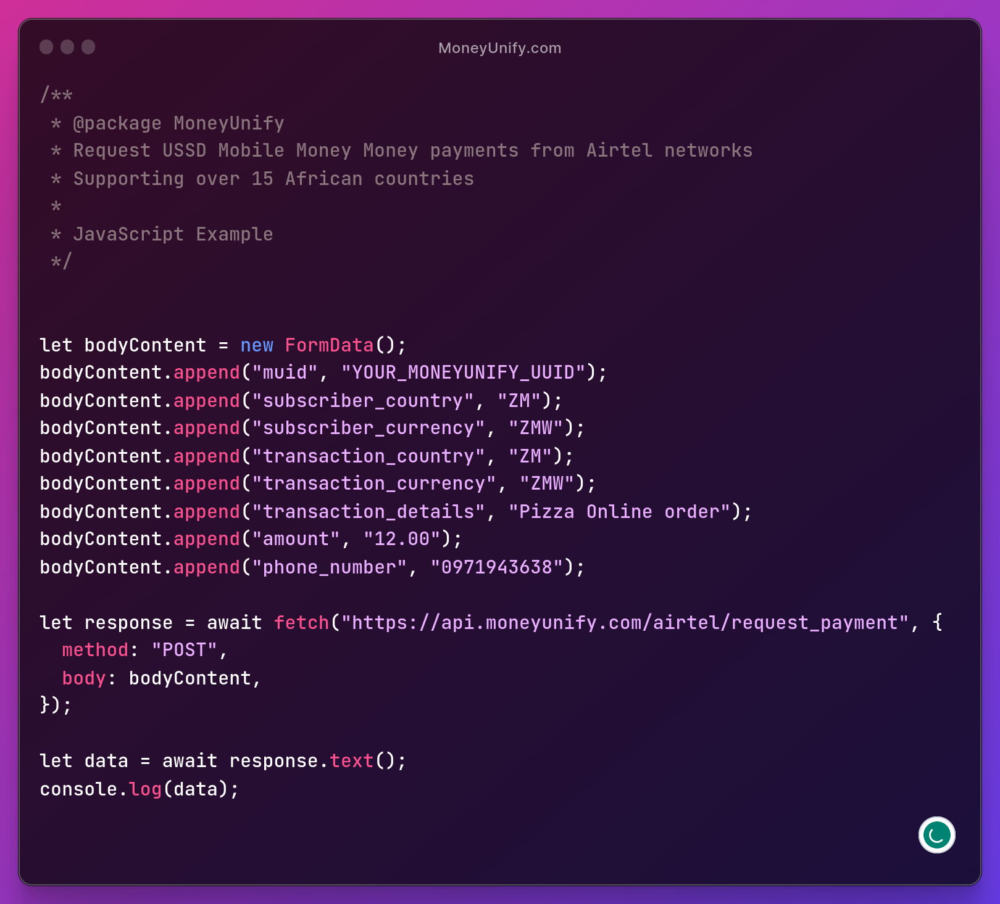
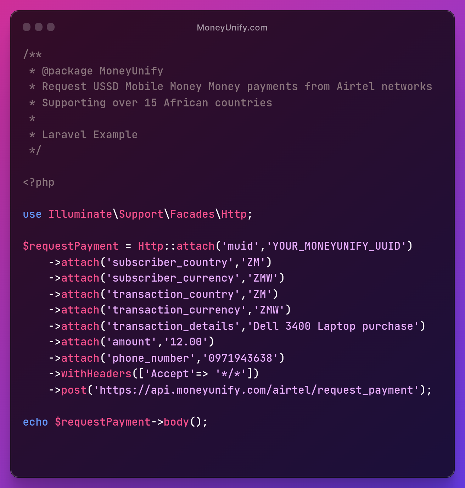

# MoneyUnify

How to Collect and Send Money Using MoneyUnify with - Airtel Merchant account
  > *AIRTEL* to *Airtel*, Instant mobile Money collections and disbursements **in over 15 African countries** with the flexibility of settling funds to your bank or mobile money account.

Begin by creating your developer account on the Official [Airtel Developer portal](https://developers.airtel.africa/home). Thereafter, configure your keys on the [MoneyUnify Dashboard](https://dashboard.moneyunify.com) and move on to collecting or disbursing as guided below.

## Collecting online Mobile Payments - [ Airtel Money - example]
> Use your favourite stack to collect money via USSD from customers in over 15 African countries

- **API Collection URL** ***https://api.moneyunify.com/airtel/request_payment*** - *POST*

<table>
  <thead>
    <tr>
      <th>Javascript</th>
      <th>Laravel</th>
    </tr>
  </thead>
  <tbody>
    <tr>
      <td>
        
      </td>
      <td>
        
      </td>
    </tr>
   </tbody>
</table>

## Airtel is  Available in over 15 African countries
  > 2% - 2.5% transaction fees
  - [x] Collect mobile Money payments from *Airtel*  networks
  - [x] API Disbursments are coming soon

### Supported Countries on the Airtel mobile Money USSD provider

<table>
  <thead>
  <tr>
  <th>Country</th>
  <th class="width-col">Country Code</th>
  <th>Currency</th>
  <th class="width-th-col">Currency Code</th>
  </tr>
  </thead><tbody>
  <tr>
  <td>UGANDA</td>
  <td class="text-center">UG</td>
  <td>Ugandan shilling</td>
  <td class="text-center">UGX</td>
  </tr>
  <tr>
  <td>NIGERIA</td>
  <td class="text-center">NG</td>
  <td>Nigerian naira</td>
  <td class="text-center">NGN</td>
  </tr>
  <tr>
  <td>TANZANIA</td>
  <td class="text-center">TZ</td>
  <td>Tanzanian shilling</td>
  <td class="text-center">TZS</td>
  </tr>
  <tr>
  <td>KENYA</td>
  <td class="text-center">KE</td>
  <td>Kenyan shilling</td>
  <td class="text-center">KES</td>
  </tr>
  <tr>
  <td>RWANDA</td>
  <td class="text-center">RW</td>
  <td>Rwandan franc</td>
  <td class="text-center">RWF</td>
  </tr>
  <tr>
  <td>ZAMBIA</td>
  <td class="text-center">ZM</td>
  <td>Zambian kwacha</td>
  <td class="text-center">ZMW</td>
  </tr>
  <tr>
  <td>GABON</td>
  <td class="text-center">GA</td>
  <td>CFA franc BEAC</td>
  <td class="text-center">CFA</td>
  </tr>
  <tr>
  <td>NIGER</td>
  <td class="text-center">NE</td>
  <td>CFA franc BCEAO</td>
  <td class="text-center">XOF</td>
  </tr>
  <tr>
  <td>CONGO-BRAZZAVILLE</td>
  <td class="text-center">CG</td>
  <td>CFA franc BCEA</td>
  <td class="text-center">XAF</td>
  </tr>
  <tr>
  <td>DR CONGO</td>
  <td class="text-center">CD</td>
  <td>Congolese franc</td>
  <td class="text-center">CDF</td>
  </tr>
  <tr>
  <td>DR CONGO</td>
  <td class="text-center">CD</td>
  <td>United States dollar</td>
  <td class="text-center">USD</td>
  </tr>
  <tr>
  <td>CHAD</td>
  <td class="text-center">TD</td>
  <td>CFA franc BEAC</td>
  <td class="text-center">XAF</td>
  </tr>
  <tr>
  <td>SEYCHELLES</td>
  <td class="text-center">SC</td>
  <td>Seychelles rupee</td>
  <td class="text-center">SCR</td>
  </tr>
  <tr>
  <td>MADAGASCAR</td>
  <td class="text-center">MG</td>
  <td>Malagasy ariary</td>
  <td class="text-center">MGA</td>
  </tr>
  <tr>
  <td>MALAWI</td>
  <td class="text-center">MW</td>
  <td>Malawian kwacha</td>
  <td class="text-center">MWK</td>
  </tr>
  </tbody>
</table>

# This project was built/tested with

- PHP 8

# Author

👤 **Blessed Jason Mwanza** - [Buy me A Coffee](https://www.buymeacoffee.com/mwanzabj) 

- Portfolio : [https://blessedjasonmwanza.tech](https://blessedjasonmwanza.tech)

- LinkedIn: [Connect with me on LinkedIn](https://www.linkedin.com/in/blessedjasonmwanza)

- Github : [@blessedjasonmwanza](https://github.com/blessedjasonmwanza)

- Twitter : [Follow me @mwanzabj](https://twitter.com/mwanzabj)

- Youtube : [Youtube](https://www.youtube.com/@blessedjasonmwanza)

# 🤝 Contributing

Contributions, issues, and feature requests are welcome!

Feel free to check the [issues page](https://github.com/blessedjasonmwanza/MoneyUnify/issues).

# Show your support

Give a ⭐️ if you like this project!
 
