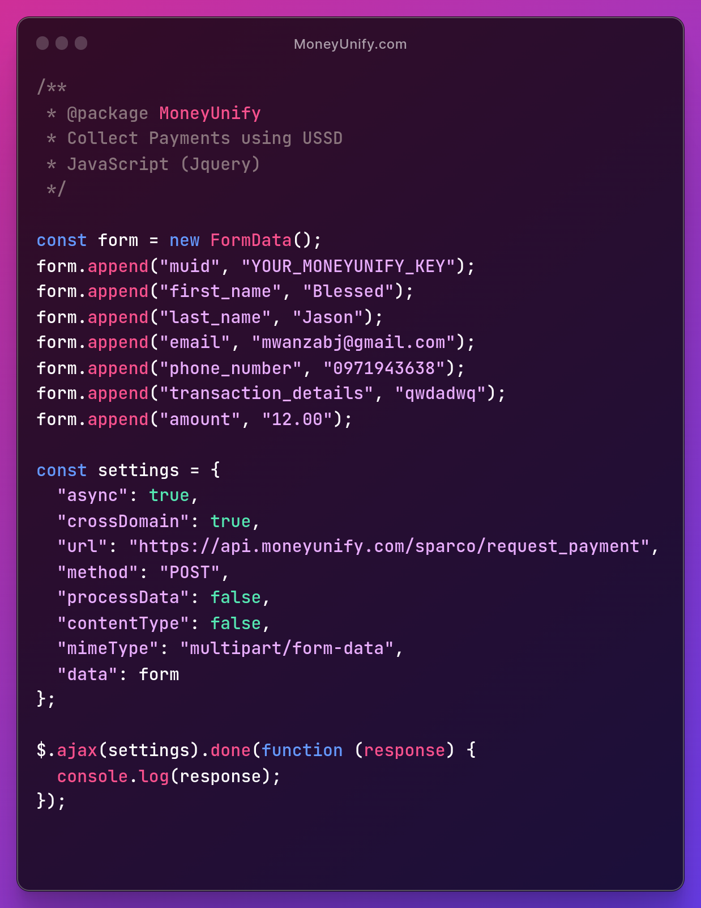
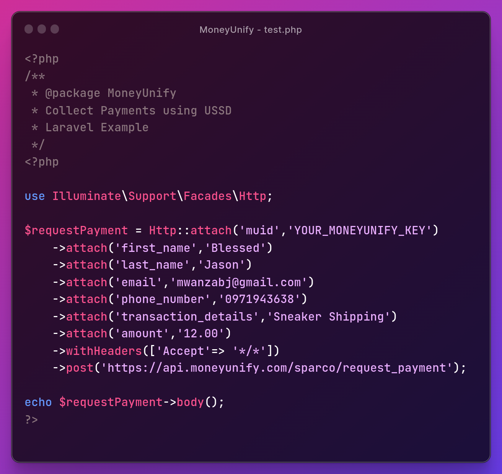
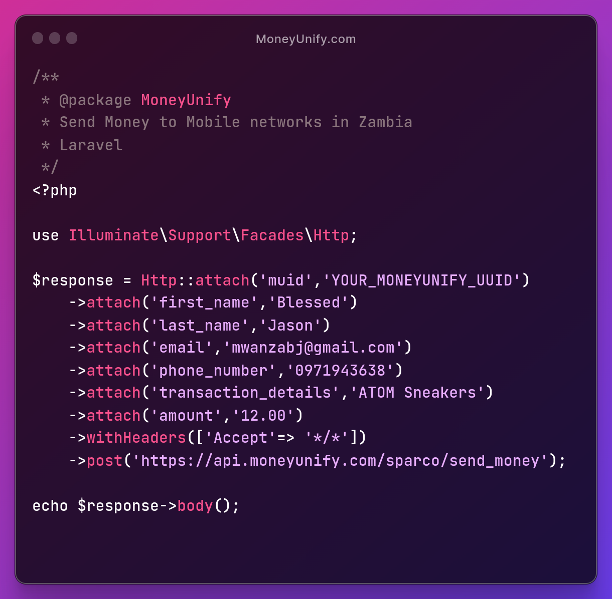

# [MoneyUnify](https://github.com/blessedjasonmwanza/MoneyUnify)


Before you proceed, we recommend you use [Moneyunify endpoint](../Moneyunify/ReadMe.md) instead. Unless, you have an approved account with Sparco gateway.

## How to Collect and Send Money Using MoneyUnify with a Sparco Merchant account

  > *AIRTEL*, *MTN*, & *ZAMTEL*  Instant mobile Money collections and disbursements **in Zambia** with the flexibility of settling funds to your bank or mobile money account.

 
## SETUP

-  Login to your Sparco account [here](https://gateway.sparco.io/) then, go to ```Settings``` tab in order to obtain both your public and private/secret keys


 - Create your account on [MoneyUnify](https://dashboard.moneyunify.com) and use your above-obtained keys to create your  muid (MoneyUnify ID)

<hr>

## Collecting online Mobile Payments [example]
> Use your favorite stack to collect money via USSD from customers in Zambia

- **API Collection URL** ***https://api.moneyunify.com/sparco/request_payment*** - *POST*

### PHP Curl Example - Request payment from customer
```PHP

<?php

$curl = curl_init();

//Setup transaction details
$data = [
    'muid' => 'YOUR_MONEY_UNIFY_ID_HERE', //get it from your money unify dashboard https://dashboard.moneyunify.com/
    'first_name' => 'Customer_first_name',
    'last_name' => 'Customer_last_name',
    'email' => 'Customer_email',
    'phone_number' => 'customer_phone_number', // Customer mobile money phone number where funds are to be deducted. e.g 260971943638 
    'transaction_details' => 'Dell Laptop 3400', //Description of transaction / product being purchased
    'amount' => '2500' // valid number amount e.g 2.45 or 2345 or 23213.04. 2500 is just an example
];

curl_setopt_array($curl, [
    CURLOPT_URL => "https://api.moneyunify.com/sparco/request_payment",
    CURLOPT_RETURNTRANSFER => true,
    CURLOPT_ENCODING => "",
    CURLOPT_MAXREDIRS => 10,
    CURLOPT_TIMEOUT => 30,
    CURLOPT_HTTP_VERSION => CURL_HTTP_VERSION_1_1,
    CURLOPT_CUSTOMREQUEST => "POST",
    CURLOPT_POSTFIELDS => $data,
    CURLOPT_HTTPHEADER => [
        "Accept: */*",
        "Content-Type: application/x-www-form-urlencoded"
    ],
]);

// Trigger payment
$response = curl_exec($curl);
$err = curl_error($curl);

curl_close($curl);

if ($err) {
    echo "cURL Error #:" . $err;
} else {
    echo $response;
}

// see API responses below image examples for your eased debugging

```

**You love learning using videos?** 
 > We have API documentation videos [here](https://www.youtube.com/watch?v=FSiqu8u0SjE&list=PLfHq8ygfMtd7pvjYNQUuZAaxLAxg6hSN8&pp=gAQBiAQB)


<table>
  <thead>
    <tr>
      <th>Jquery</th>
      <th>Laravel</th>
    </tr>
  </thead>
  <tbody>
    <tr>
      <td>
        
      </td>
      <td>
        
      </td>
    </tr>
   </tbody>
</table>


<table>
  <thead>
    <tr>
      <th>Vanilla JS using (Axios)</th>
      <th>JavaScript using (fetch)</th>
    </tr>
  </thead>
  <tbody>
    <tr>
      <td>
        
      </td>
      <td>
        
      </td>
    </tr>
  </tbody>
</table>


<hr />


## SUCCESS Message Examples

> If the transaction request is successful, you will get responses like these.
```json
{
  // wating for user to enter pin
  "message": "Transaction pending authorization.",
  "data": {
    "amount": 1.93,
    "currency": "ZMW",
    "customerFirstName": "john",
    "customerLastName": "doe",
    "customerMobileWallet": "0971943638",
    "feeAmount": 0.07,
    "feePercentage": 3.5,
    "merchantReference": "0970xx_1191149585",
    "reference": "eyJ0aWQqweqdwqdrwerwwe2NzgsImVudiI6InAifQ",
    "responseCode": 200,
    "status": "TXN_AUTH_PENDING",
    "transactionAmount": 2
  },
  "isError": false
}
// user approved transaction
{
  "message": "Transaction pending authorization.",
  "data": {
    "amount": 1.93,
    "currency": "ZMW",
    "customerFirstName": "john",
    "customerLastName": "doe",
    "customerMobileWallet": "0971943638",
    "feeAmount": 0.07,
    "feePercentage": 3.5,
    "merchantReference": "0970xx_1191149585",
    "reference": "eyJ0aWQqweqdwqdrwerwwe2NzgsImVudiI6InAifQ",
    "responseCode": 200,
    "status": "TXN_AUTH_PENDING",
    "transactionAmount": 2
  },
  "isError": false
}
```

## Error Message examples

If a transaction request has failed, you will get responses like these.

```json
{
    "isError": true,
    "message": "request not authorized",
    "console":
    {
        "responseCode": 403
    }
}

//or

{
  "message": "Invalid phone number",
  "console": {
    "muid": "YOUR_MONEY_UNIFY ID",
    "phone_number": "097943638",
    "transaction_details": "Test order",
    "amount": "2",
    "email": "mwanzabj@gmail.com",
    "first_name": "BLessed jason",
    "last_name": "Mwanza"
  },
  "isError": true
}
```

<hr />


## Sending, Crediting / sending money to mobile networks[example]
> Use your favourite stack to Transfer your collections to Zamtel or MTN Mobile networks in Zambia

> Funds / Money in your merchant account can also be settled directly to your bank account

API works the same as collections above include required parameters. What changes is the endpoint url. use the one below instead, for disbursements;
- **API Disbursement URL** ***https://api.moneyunify.com/sparco/send_money*** - *POST*


<table>
  <thead>
    <tr>
      <th>Jquery</th>
      <th>Laravel</th>
    </tr>
  </thead>
  <tbody>
    <tr>
      <td>
        
      </td>
      <td>
        
      </td>
    </tr>
   </tbody>
</table>


<br />

# This project was built/tested with

- PHP 8

# Author

👤 **Blessed Jason Mwanza** - [Buy me A Coffee](https://www.buymeacoffee.com/mwanzabj) 

- Portfolio : [https://blessedjasonmwanza.tech](https://blessedjasonmwanza.tech)

- LinkedIn: [Connect with me on LinkedIn](https://www.linkedin.com/in/blessedjasonmwanza)

- Github : [@blessedjasonmwanza](https://github.com/blessedjasonmwanza)

- Twitter : [Follow me @mwanzabj](https://twitter.com/mwanzabj)

- Youtube : [Youtube](https://www.youtube.com/@blessedjasonmwanza)

# 🤝 Contributing

Contributions, issues, and feature requests are welcome!

Feel free to check the [issues page](https://github.com/blessedjasonmwanza/MoneyUnify/issues).

# Show your support

Give a ⭐️ if you like this project!
 
