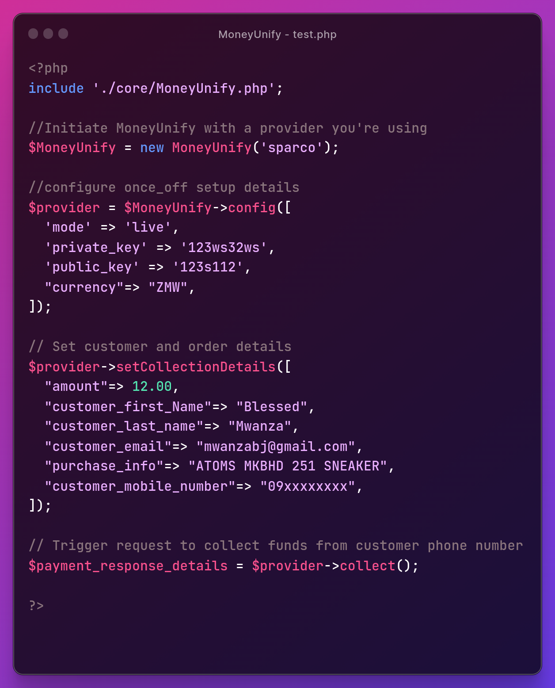

# MoneyUnify

> Mobile Money Payments integration simplified

__*Let's simplify online payments for everyone! ... Feel Free to Contribute *__
>
 - Africa
 - The World

## Currently in Development
 - *MasterCard, VISA, ECOBANK QR CODE payments*
    ### Status
    - TBA

## LIVE & READY FOR USE
 - *Sparco* // for AIRTEL, MTN, & ZAMTEL  Instant mobile Money collections
 # SETUP
 
 Follow the Setup Instructions [Here](./Examples/Sparco/ReadMe.md);

# This project was built/tested with

- PHP 8

# Author

👤 **Blessed Jason Mwanza**
- Portfolio : [http://blessedjasonmwanza.me](http://blessedjasonmwanza.me)

- LinkedIn: [Connect with me on LinkedIn](https://www.linkedin.com/in/blessedjasonmwanza)

- Github : [@blessedjasonmwanza](https://github.com/blessedjasonmwanza)

- Twitter : [Follow me @mwanzabj](https://twitter.com/mwanzabj)

- Youtube : [Youtube](https://www.youtube.com/@blessedjasonmwanza)

# 🤝 Contributing

Contributions, issues, and feature requests are welcome!

Feel free to check the [issues page](https://github.com/blessedjasonmwanza/MoneyUnify/issues).

# Show your support

Give a ⭐️ if you like this project!
 
